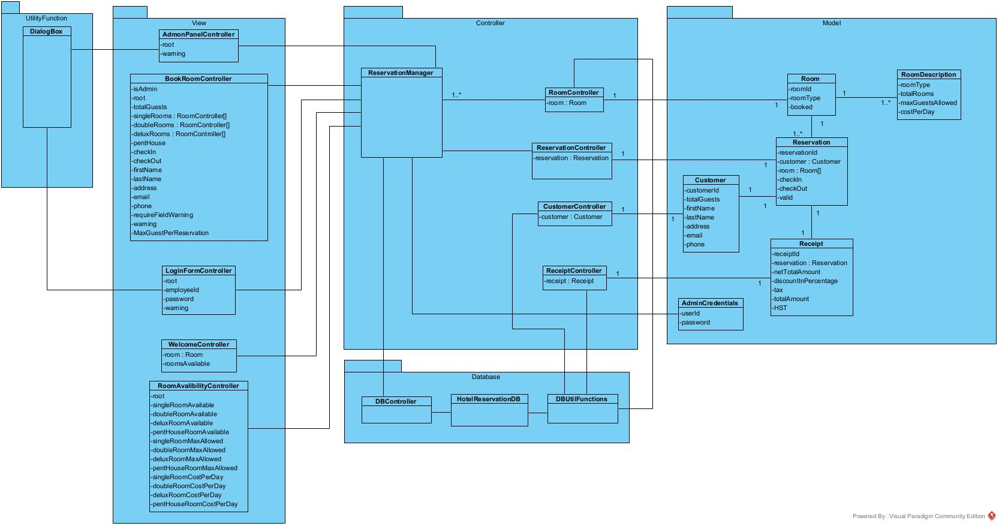

# Hotel Reservation System

## Description

This is a hotel reservation management system for **Hotel Blue Queen**. Hotel customers can use the system to fill in the information and based on that, the system can suggest the number of room/s the customer should take. Subsequently the customer can go ahead and book room/s as per the choice. The application also has an admin dashboard which shows all the information, such as how many rooms are book, list of the guest staying in the hotel etc. The admin dashboard has the authority to make/stash any booking.

## System

### Tech Stack

### Class Diagram

## How it looks?

<a href="https://github.com/busycaesar/Hotel_Reservation_System/blob/Master/ApplicationLooks.md">Application Looks</a>

## Features

### Book Room

Customer as well as admin can book the room/s using book room page. Security features of the book room page are as follows:

- No fields marked with (*) can be empty.
- Email and phone should be in a proper format.
- The minimum check in date is current date and that of check out is check in date plus one.
- Cannot book rooms which accomodates less guests than the number of guests visiting.

The page shows appropriate error in case of any of the above sitution.

### Admin Panel

The admin panel can only be accessed by the authorized personels. There are two credentails for logging in as an admin. Admin panel has the following options:

- **Available Rooms**: Check the number of available rooms along with the room type.
- **Current Bookings**: This allows the admin to check the list of all the current booking. Further, admin can 'Generate Receipt' for any of the current booking along with an option to offer some discount.
- **All Reservations**: Check all the reservations, both current as well as checked out.
- **All Customers**: Check all the customers, both current as well as checked out. Moreover, there is also an option to check the reservation of a specific customer; in addition to the detail if the customer has already paid or not.
